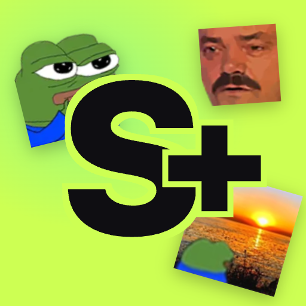

<div align="center">
  

  <h1>Streamoji — Landing</h1>

  <p><strong>Convert Twitch &amp; 7TV emotes into WhatsApp sticker packs.</strong><br/>
  Free Android app. This repo is the marketing site at <a href="https://streamoji.stream">streamoji.stream</a>.</p>

  <p>
    <a href="https://streamoji.stream"></a>
    <a href="https://play.google.com/store/apps/details?id=me.xbernikov.emotetv"></a>
  </p>

  <p>
    
    
    
    
  </p>
</div>

---

## What's this?

A single-page marketing site for **Streamoji**, an Android app that ports Twitch and 7TV emotes (KEKW, peepoComfy, monkaW, catJam, all of them) into real WhatsApp sticker packs with one tap.

No image editing, no third-party bots, no manual WebP conversion. The mobile app does the file wizardry; this repo is just the front door.

## Tech stack

| Layer       | Choice                             | Why                                                                  |
|-------------|------------------------------------|----------------------------------------------------------------------|
| Framework   | **Astro 5**                        | Ships zero JS by default — perfect for a landing                     |
| Styles      | **Tailwind 4** (via Vite plugin)   | Utility-first + `@theme` tokens for the custom palette/fonts         |
| Hosting     | **Cloudflare Pages**               | Free, global CDN, drop-in static deploy                              |
| Fonts       | Bungee + Bungee Shade + Manrope    | Loud display fonts for the chaos hero, neutral body for legibility   |
| Images      | AVIF emote sprites                 | ~10× smaller than PNG at the same visual quality                     |
| SEO         | `@astrojs/sitemap` + JSON-LD       | `SoftwareApplication` schema for app-card rich results               |

## Run it locally

```bash
git clone https://github.com/xbernikov/streamoji-web.git
cd streamoji-web
npm install
npm run dev          # → http://localhost:4321
```

## Build

```bash
npm run build        # outputs static files to dist/
npm run preview      # serves the built dist/ locally
```

The build emits plain HTML/CSS/JS plus a `sitemap-index.xml`. No server, no SSR, no Node runtime in production.

## Deploy to Cloudflare Pages

**Git-connected (recommended — auto-deploys every push):**

1. Push this repo to GitHub.
2. Cloudflare dashboard → **Workers &amp; Pages** → **Create** → **Pages** → **Connect to Git**.
3. Build settings:
   - **Framework preset:** Astro
   - **Build command:** `npm run build`
   - **Build output directory:** `dist`
   - **Environment variable:** `NODE_VERSION=20`

**Drag-and-drop (no Git):**

```bash
npm run build
# then drag the dist/ folder into pages.cloudflare.com
```

**Custom domain:** Pages dashboard → your project → **Custom domains** → enter `streamoji.stream`. SSL is automatic.

## Project structure

```
src/
├── layouts/
│   └── Layout.astro              site-wide <head>, fonts, OG meta, JSON-LD
├── pages/
│   └── index.astro               composes the landing
├── components/
│   ├── Nav.astro                 sticky top nav
│   ├── BgStickers.astro          drifting background emotes
│   ├── Hero.astro                headline + phone mockup + exploding stickers
│   ├── Marquees.astro            two rolling text bars
│   ├── StickerWall.astro         24-tile sticker grid (data-driven)
│   ├── HowItWorks.astro          3-step section
│   ├── FinalCTA.astro            closing Play Store CTA
│   └── Footer.astro
├── styles/
│   └── global.css                Tailwind import + design tokens + keyframes
└── data/
    └── stickers.ts               sticker list rendered on the wall
public/
├── icon-512.png                  app icon (favicon + nav logo, shared)
├── apple-touch-icon.png
├── favicon-{16,32}.png
├── robots.txt
└── assets/
    ├── app-screen.png            phone-mockup screenshot
    └── emotes/*.avif             sticker images
```

## Credits

- App built by [@xbernikov](https://github.com/xbernikov).
- Emote artwork belongs to its respective creators on Twitch / 7TV / BTTV. This site is **not affiliated** with Twitch, 7TV, BetterTTV, or WhatsApp.

## License

The landing page source in this repo is MIT. Emote images in `public/assets/emotes/` are property of their original creators and are included for demonstration only.
